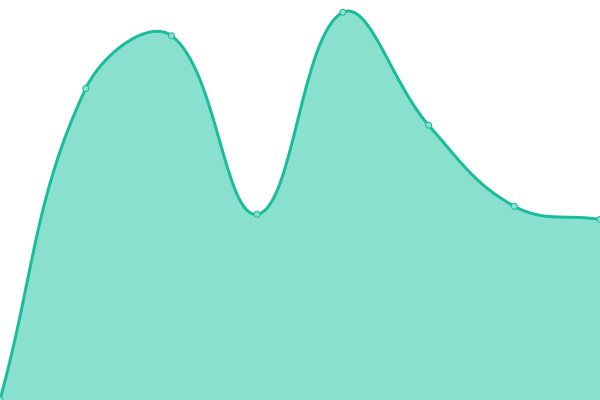
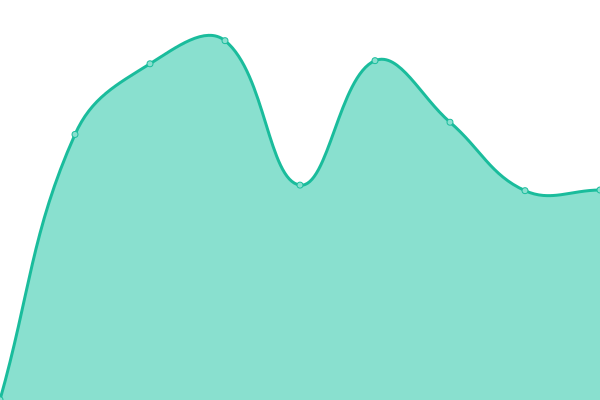
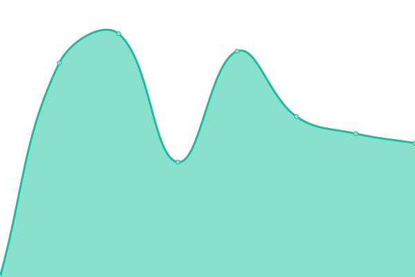
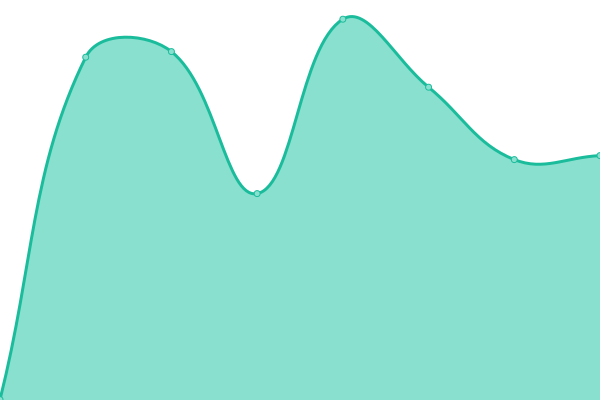

# [📈 Live Status](https://upptime.github.io/upptime): <!--live status--> **🟩 All systems operational**

This repository contains the open-source uptime monitor and status page for [Upptime](https://upptime.js.org), powered by [Upptime](https://github.com/upptime/upptime).

With [Upptime](https://upptime.js.org), you can get your own unlimited and free uptime monitor and status page, powered entirely by a GitHub repository. We use [Issues](https://github.com/upptime/upptime/issues) as incident reports, [Actions](https://github.com/upptime/upptime/actions) as uptime monitors, and [Pages](https://upptime.github.io/upptime) for the status page.

<!--start: status pages-->
<!-- This summary is generated by Upptime (https://github.com/upptime/upptime) -->
<!-- Do not edit this manually, your changes will be overwritten -->
<!-- prettier-ignore -->
| URL | Status | History | Response Time | Uptime |
| --- | ------ | ------- | ------------- | ------ |
|  [DCLIC-001](https://www.dclic.info) | 🟩 Up | [dclic-001.yml](https://github.com/EmbDclic/upptime/commits/HEAD/history/dclic-001.yml) | 

 1099ms
     
 | 

<a href="https://EmbDclic.github.io/upptime/history/dclic-001">100.00%</a>
    

|  [DCLIC-002](https://dclic.ovh) | 🟩 Up | [dclic-002.yml](https://github.com/EmbDclic/upptime/commits/HEAD/history/dclic-002.yml) | 

 812ms
     
 | 

<a href="https://EmbDclic.github.io/upptime/history/dclic-002">100.00%</a>
    

|  [DCLIC-003](https://dclic-003.ovh) | 🟩 Up | [dclic-003.yml](https://github.com/EmbDclic/upptime/commits/HEAD/history/dclic-003.yml) | 

 831ms
     
 | 

<a href="https://EmbDclic.github.io/upptime/history/dclic-003">100.00%</a>
    

|  TL | 🟩 Up | [tl.yml](https://github.com/EmbDclic/upptime/commits/HEAD/history/tl.yml) | 

 1441ms
     
 | 

<a href="https://EmbDclic.github.io/upptime/history/tl">100.00%</a>
    

|  TT | 🟩 Up | [tt.yml](https://github.com/EmbDclic/upptime/commits/HEAD/history/tt.yml) | 

 1005ms
     
 | 

<a href="https://EmbDclic.github.io/upptime/history/tt">100.00%</a>
    

|  GHT | 🟩 Up | [ght.yml](https://github.com/EmbDclic/upptime/commits/HEAD/history/ght.yml) | 

 1021ms
     
 | 

<a href="https://EmbDclic.github.io/upptime/history/ght">100.00%</a>
    

|  CHM | 🟩 Up | [chm.yml](https://github.com/EmbDclic/upptime/commits/HEAD/history/chm.yml) | 

 3545ms
     
 | 

<a href="https://EmbDclic.github.io/upptime/history/chm">100.00%</a>
    

<!--end: status pages-->

[**Visit our status website →**](https://embdclic.github.io/upptime)

## 📄 License

- Powered by: [Upptime](https://github.com/upptime/upptime)
- Code: [MIT](./LICENSE) © [Upptime](https://upptime.js.org)
- Data in the `./history` directory: [Open Database License](https://opendatacommons.org/licenses/odbl/1-0/)
